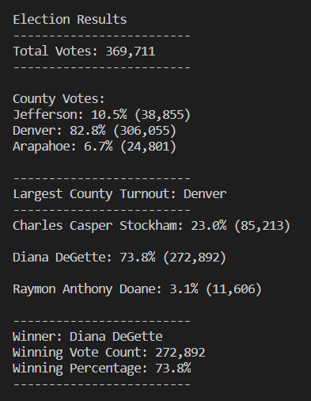

# Election Analysis

## Overview of Election Audit
The project was to assist Seth and Tom in conducting an audit of a  recent local congressional election. The election commission has requested the following:
*  The number of total votes received.
*  The names of the each candidate, along with
*  The percentage of the total number of votes
*  The number of votes they received
* For each county, who:
	The county names
	The percentage of the total that each county tallied
	The total number of votes in each county
	Which county had the largest turnover.

To do this, I did the following used the election_results.csv file to do the following:
- Calculate the total number of votes cast.
- Get a complete list of candidates who received votes.
- Calculate the total number of votes each candidate received.
-  Calculate the percentage of votes each candidate won.
-  Determine the winner of the election based on popular vote.

## Election Audit Results
The analysis of the election shows that:
- There were 369,711 total votes cast in the election.
- The winners were:
	1st place - Diana DeGette who had a total of 272,892 votes which was 73.8% of the votes cast.
	2nd place was Diana DeGette who had a total of 272,892 votes which was 73.8% of the votes cast.
	3rd place runner-up was Diana DeGette who had a total of 272,892 votes which was 73.8% of the votes cast.
- On the county level, Denver County had the greatest turnout.
- On the county level:
- 	Denver County had the greatest turnout with 82.8%, or 305,055.
- 	Jeffersion County had the second number of votes with 10.5% of the total, or 38,855 votes.
- 	Arapahoe County had the third number of notes with 6.7% of the total, or 24,801 votes.

To get this information, we used looping to do it.

Here is a screenshot of the terminal showing these results:
  

## Election Audit Summary
To summarize, this script worked well for its purpose and can be re-used, with some modifications, for any election. 

If needed, it can be modified in these ways for other elections:
- It can show how wide of a margin the winner won over the second-place candidate.
- It can show the candidate statistics by county, showing who won in each county, the percentage of votes received in that county, and the number of votes in each county.

